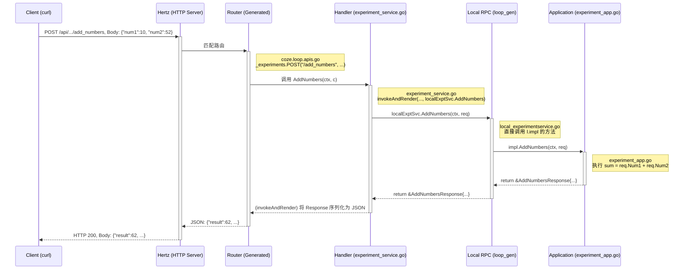

# 部署问题

阿里云镜像不能识别latest标签（下的是3年前的版本，而且还不报错很隐蔽），要手动选择版本

构建过程网速慢，连接中断：
在Dockerfile开头（FROM golfing:1.23.4后面）

```dockerfile
# ==================== 新增代理配置 ====================
ARG http_proxy
ARG https_proxy
ENV http_proxy=$http_proxy
ENV https_proxy=$https_proxy
# =======================================================
```

在docker-compose.yml中加代理服务器（代理服务要启动好监听10809）

```dockerfile
  app:
    platform: linux/amd64
    build:
      context: .
      dockerfile: Dockerfile
      args:
        RUN_MODE: ${RUN_MODE:-dev}
        http_proxy: http://172.17.0.1:10809  # 加
        https_proxy: http://172.17.0.1:10809 # 加
```

但是这会导致app服务的healthcheck过不了，而前端nginx服务以来于app服务condition: service_health，app服务的health_check定义为运行/cozeloop/conf/nginx/healthcheck.sh，这个文件是本地通过volumes参数挂载过去的。

运行``docker exec -it cozeloop-app sh ``进入app内部，运行起healthcheck发现确实运行失败。

```sh
#!/bin/sh
HOST="localhost"
PORT="8888"
BASE_URL="http://${HOST}:${PORT}"

curl -s "${BASE_URL}/ping" | grep -q pong
```

直接运行没有效果，用-v标志显示整个过程，发现这里面走代理了，所以内部请求失败了。

```sh
# curl -v http://localhost:8888/ping
* Uses proxy env variable http_proxy == 'http://172.17.0.1:10809'
*   Trying 172.17.0.1:10809...
* Connected to 172.17.0.1 (172.17.0.1) port 10809 (#0)
> GET http://localhost:8888/ping HTTP/1.1
> Host: localhost:8888
> User-Agent: curl/7.88.1
> Accept: */*
> Proxy-Connection: Keep-Alive
>
< HTTP/1.1 503 Service Unavailable
< Connection: close
* HTTP/1.1 proxy connection set close
< Proxy-Connection: close
< Content-Length: 0
```

因此在开头（app的healthcheck.sh）加``export no_proxy="localhost,127.0.0.1"``不走代理，就解决了healthcheck的问题，前端服务也就能启动了。

总结就是既然healthcheck出问题，就该找healthcheck是谁决定的。

前面还怀疑是root用户的问题，也不确定，有可能确实有，然后配了个新skycat用户又配置了半天。

然后把在root里git clone的文件夹直接sudo mv过去了，估计也有很多权限问题，又重新拉了一个。

nginx也unhealhty，检测用的``curl "http://localhost:80" | grep -p 'nginx'``，确实响应没有nginx，改成``curl -v "http://localhost:80" | grep -p 'nginx'``就有了。

# git开发

## 基本流程

先fork然后捆绑upstream流

```bash
git clone https://github.com/YOUR_NAME/coze-loop.git
cd coze-loop
git remote add upstream https://github.com/coze-dev/coze-loop.git
```

个人开发放在develop分支，develop分支只merge

```bash
git checkout -b develop
git push -u origin develop
```

加新功能

```bash
git checkout -b feature/my-awesome-feature
git add .
git commit- m "feat: 实现xx逻辑"
git add .
git commit -m "fix: 修复xx功能的bug"
```

日常开发循环

```bash
# (a) 更新你的本地 main 分支
git checkout main
git fetch upstream
git merge upstream/main

# (b) 将官方更新合并到你的 develop 分支
git checkout develop
git merge main

# (c) 把更新后的 develop 推送到你的 Fork
git push origin develop
```

合并到develop

```bash
# (a) 切回 develop 分支
git checkout develop

# (b) 合并功能分支
git merge --no-ff feature/my-awesome-feature
# --no-ff (No Fast-Forward) 会创建一个合并提交，让你的历史记录更清晰地看出这是一次功能合并。

# (c) 将集成了新功能的 develop 分支推送到你的 Fork
git push origin develop

# (d) (可选但推荐) 删除已经合并的、不再需要的功能分支
git branch -d feature/my-awesome-feature
```

# docker

局部一个服务加日志限制

```yaml
services:
  app:
  	# ...
    logging:
      options:
        max-size: "10m"
        max-file: "5"
```

全局限制

```json
// /etc/docker/daemon.json 文件内容
{
  "log-driver": "json-file",
  "log-opts": {
    "max-size": "500m",
    "max-file": "3"
  }
}
```

看日志

```bash
docker compose logs -f # follow
docker compose logs -f app nginx # docker compose可同时看多个
docker compose logs app

# 或者不用compose，用docker ps的NAME列
docker logs -f cozeloop-nginx
```

开发应该在docker image里面开发，./devcontainer/.devcontainer.json配好要装的插件等。

Dockerfile里面配好中文包（可以在内部git commit中文）

```sh
curl -X POST http://8.130.124.150:8082/api/evaluation/v1/experiments/add_numbers \
-H "Content-Type: application/json" \
-b "session_key=eyXXXXXXXXXXXXX" \
-d '{"num1": 10, "num2": 52}'
```

``` js
fetch('/api/evaluation/v1/experiments/add_numbers', {
    // 1. 请求方法
    method: 'POST',
    // 2. 请求头
    headers: {
        'Content-Type': 'application/json'
    },
    // 3. 请求体 (注意：需要将JS对象转换为JSON字符串)
    body: JSON.stringify({
        num1: 100,
        num2: 23
    })
})
.then(response => response.json()) // 将响应体解析为JSON
.then(data => console.log(data))   // 将解析后的数据显示在控制台
.catch(error => console.error('请求失败:', error)); // 如果请求失败，打印错误
```


# 基本开发流程

## 以新加一个a+b接口为例

“这么多乱七八糟的，他们是怎么连接的？”

这个问题问到了这套框架（基于 **CloudWeGo** 的 Kitex 和 Hertz）设计的精髓。下面我将为你详细剖析一个 POST 请求从 `curl` 发出，到你的业务逻辑 `AddNumbers` 被执行，再到响应返回的全过程，并解释 `diff` 中每个文件的角色。

### 核心理念：通过 IDL 定义，代码生成，分层解耦

这套架构的核心思想是：

1. **IDL (Interface Definition Language)先行**: 使用 Thrift (`.thrift` 文件) 作为唯一的事实来源（Single Source of Truth），来定义服务接口、请求和响应的数据结构。
2. **代码生成**: 运行脚本 (`code_gen.sh`)，使用 `kitex` 和 `hz` 工具，根据 IDL 自动生成所有必要的“胶水代码”，包括数据结构序列化/反序列化、RPC 客户端/服务端、HTTP 路由和处理器骨架。
3. **分层与解耦**: 开发者只需要关注两个地方：

- **API Handler 层**: 处理 HTTP 相关的逻辑（从哪来，到哪去）。
- **Application/Service 层**: 实现纯粹的业务逻辑（做什么）。
- 中间的所有连接、转换、调用都由生成的代码和框架处理。

------

### 一、请求的旅程：从 `curl` 到 `AddNumbers` 再返回

让我们跟着你的 `curl` 请求走一遍：



### 二、`diff` 中各个文件的角色详解

让我们按照请求的顺序来解释每个文件。

#### 1. 定义层 (IDL - Interface Definition Language)

**文件**: `idl/thrift/coze/loop/evaluation/coze.loop.evaluation.expt.thrift`

**你的修改**:

- 添加了 `AddNumbersRequest` 和 `AddNumbersResponse` 两个 `struct`。这是数据的形状。

- 在 `ExperimentService` 中添加了 `AddNumbersResponse AddNumbers(...)` 方法。这是接口的行为。
- `api.post = '...'` 这个注解至关重要，它告诉 `hz` 工具为这个服务方法生成一个 HTTP POST 路由。

**作用**: **【蓝图/合同】**。这是所有后续代码生成的源头。你在这里定义了 “我们要提供一个叫 `AddNumbers` 的功能，它接收两个 `double`，返回一个 `double`，并通过这个 URL 暴露”。

#### 2. 代码生成 (`code_gen.sh`)

**作用**: **【建筑工人】**。这个脚本调用了 CloudWeGo 的 `kitex` 和 `hz` 工具，读取你的 `.thrift` 蓝图，并生成大量 Go 代码。

#### 3. 生成的数据结构与序列化代码

**文件**:

- `backend/kitex_gen/coze/loop/evaluation/expt/coze.loop.evaluation.expt.go`
- `backend/kitex_gen/coze/loop/evaluation/expt/k-coze.loop.evaluation.expt.go`
- `backend/kitex_gen/coze/loop/evaluation/expt/coze.loop.evaluation.expt_validator.go`

`diff` **中的变化**: 文件里出现了 `AddNumbersRequest` 和 `AddNumbersResponse` 的 Go 结构体定义，以及大量的 `Read`, `Write`, `FastRead`, `FastWrite`, `DeepCopy` 等方法。

**作用**: **【数据模型和工具】**。

- `coze.loop.evaluation.expt.go`: 将 Thrift `struct` 翻译成 Go `struct`。这是你在代码中实际使用的 `*expt.AddNumbersRequest` 类型。
- `k-coze.loop.evaluation.expt.go`: Kitex 的 Frugal 功能生成的代码，用于更高性能的序列化/反序列化。框架内部会自动使用它。
- `..._validator.go`: 为结构体生成了 `IsValid()` 方法的存根（stub），你可以在这里添加自定义的校验逻辑。

#### 4. 生成的路由

**文件**: `backend/api/router/coze/loop/apis/coze.loop.apis.go`

**你的修改 (自动生成)**: `_experiments.POST("/add_numbers", ...)`

**作用**: **【路由表/总机】**。这是 Hertz 框架的路由注册文件。`hz` 工具读取了你 IDL 中的 `api.post` 注解，自动在这里添加了一行，将 `POST /api/evaluation/v1/experiments/add_numbers` 这个路径映射到 `apis.AddNumbers` 这个处理器函数。

**文件**: `backend/api/router/coze/loop/apis/middleware.go`

**你的修改 (自动生成)**: `_addnumbersMw`

**作用**: **【门卫】**。为每个路由自动生成了一个中间件（middleware）函数骨架。你可以在这里添加只针对 `AddNumbers` 接口的特殊逻辑，比如权限校验、日志记录等。默认返回 `nil`，表示没有中间件。

#### 5. HTTP 处理器 (Handler) - **【你修改的第一个文件】**

**文件**: `backend/api/handler/coze/loop/apis/experiment_service.go`

**你的修改**: 添加了 `AddNumbers` 函数，调用了 `invokeAndRender`。

**作用**: **【HTTP 请求接待员】**。这是请求进入应用逻辑的第一站。它的职责是：

1. 接收原始的 HTTP 请求 (`c *app.RequestContext`)。
2. **不直接处理业务**，而是调用一个通用的辅助函数 `invokeAndRender`。
3. `invokeAndRender` 会帮你完成：

- 从 HTTP 请求中解析出 JSON Body，并填充到 `AddNumbersRequest` 结构体中。
- 调用真正的服务 `localExptSvc.AddNumbers`。
- 获取 `AddNumbersResponse`，并将其序列化为 JSON，写回 HTTP 响应。

在这里把 HTTP 世界和内部服务世界连接了起来。

#### 6. 生成的 RPC 客户端与服务端框架

**文件**:

- `backend/kitex_gen/.../experimentservice/client.go`
- `backend/kitex_gen/.../experimentservice/experimentservice.go`

`diff` **中的变化**: `Client` 接口和 `kClient` 结构体中增加了 `AddNumbers` 方法。`serviceMethods` map 和处理器中也增加了 `AddNumbers` 的相关逻辑。

**作用**: **【RPC 通信协议】**。

- `client.go`: 定义了 RPC 客户端的接口。`localExptSvc` 就是这个接口的一个实现。
- `experimentservice.go`: 定义了 RPC 服务端的框架，包括如何接收请求、找到对应的方法、调用并返回。
- **关键点**: 在你的项目中，HTTP 服务和业务逻辑服务虽然在同一个进程里，但框架依然通过这套 RPC 机制进行通信。这带来一个巨大的好处：**如果未来你需要将** `evaluation` **模块拆分成一个独立的微服务，**`Handler` **层的代码几乎不需要修改**，只需要把 `localExptSvc` 的注入换成一个真正的网络 RPC 客户端即可。

#### 7. 本地 RPC 实现 (In-Process RPC)

**文件**: `backend/loop_gen/coze/loop/evaluation/loexpt/local_experimentservice.go`

**你的修改 (自动生成)**: 增加了 `AddNumbers` 方法。

**作用**: **【内部快速通道】**。这是 `experimentservice.Client` 接口的一个特殊实现。它并不发起网络请求，而是直接在内存中调用你写的业务逻辑实现 (`l.impl.AddNumbers`)。`Handler` 里的 `localExptSvc` 就是这个类型的实例。这是一种非常优雅的解耦方式。

#### 8. 业务逻辑实现 - **【你修改的第二个文件】**

**文件**: `backend/modules/evaluation/application/experiment_app.go`

**你的修改**: 手动实现了 `AddNumbers` 方法。

**作用**: **【大脑/核心工厂】**。这里是请求的最终目的地，是真正“干活”的地方。

- 它接收的是 Go 结构体 (`*expt.AddNumbersRequest`)，返回的也是 Go 结构体 (`*expt.AddNumbersResponse`)。
- 这里完全不关心 HTTP、JSON、路由等任何外部细节。它只关心业务逻辑：`sum := req.Num1 + req.Num2`。这使得业务代码非常纯粹、易于测试和维护。

#### 9. 依赖注入

**文件**: `backend/api/handler/coze/loop/apis/wire_gen.go`

**作用**: **【连接器/装配图】**。这个文件由 Google Wire (一个依赖注入工具) 生成。它负责在程序启动时，创建所有需要的对象（比如 `experimentApplication` 的实例），并将它们“连接”起来（比如，把 `experimentApplication` 实例注入到 `LocalExperimentService` 的 `impl` 字段中，再把 `LocalExperimentService` 注入到 `APIHandler` 中）。虽然你的 `diff` 里它只是小变动，但它是整个架构能自动连接起来的幕后英雄。

### 总结

你的一个简单 `AddNumbers` 功能，之所以触及这么多文件，是因为你正在使用一个高度工程化、可扩展的框架。每个文件各司其职，共同构成了一个清晰的分层结构：

| 层次            | 主要文件                               | 作用                  | 修改方式 |
| --------------- | -------------------------------------- | --------------------- | -------- |
| **定义层**      | `.thrift`                              | 合同与蓝图            | **手动** |
| **HTTP 接入层** | `handler/.../experiment_service.go`    | HTTP 接待员，转换协议 | **手动** |
| **业务逻辑层**  | `modules/.../experiment_app.go`        | 核心业务逻辑          | **手动** |
| **路由层**      | `router/.../*.go`                      | URL 路径映射          | 自动生成 |
| **数据模型层**  | `kitex_gen/.../expt/*.go`              | Go 结构体与序列化     | 自动生成 |
| **RPC 通信层**  | `kitex_gen/.../experimentservice/*.go` | RPC 客户端/服务端协议 | 自动生成 |
| **内部调用层**  | `loop_gen/.../local_*.go`              | 内存中的 RPC 实现     | 自动生成 |
| **依赖注入层**  | `wire_gen.go`                          | 自动装配所有组件      | 自动生成 |

所以，你的整个流程非常标准：

1. **改蓝图** (`.thrift`)
2. **跑脚本生成框架** (`code_gen.sh`)
3. **填空**：写 `Handler` 和 `Application` 的业务代码。

# 关注

## 需要关注的核心文件

1. **实体定义文件**：
    - [/cozeloop/backend/modules/evaluation/domain/entity/target.go](javascript:void(0)) - 评估目标类型定义
2. **服务接口文件**：
    - [/cozeloop/backend/modules/evaluation/domain/service/target.go](javascript:void(0)) - 评估目标服务接口
    - [/cozeloop/backend/modules/evaluation/domain/service/target_source.go](javascript:void(0)) - 评估目标源服务接口
3. **服务实现文件**：
    - [/cozeloop/backend/modules/evaluation/domain/service/target_impl.go](javascript:void(0)) - 评估目标服务实现
    - [/cozeloop/backend/modules/evaluation/domain/service/target_source_loopprompt_impl.go](javascript:void(0)) - Prompt 评估目标实现（可作为参考）
4. **依赖注入配置**：
    - [/cozeloop/backend/modules/evaluation/application/wire.go](javascript:void(0)) - 服务注册配置
5. **实验执行流程**：
    - [/cozeloop/backend/modules/evaluation/domain/service/expt_run_item_turn_impl.go](javascript:void(0)) - 实验项执行流程